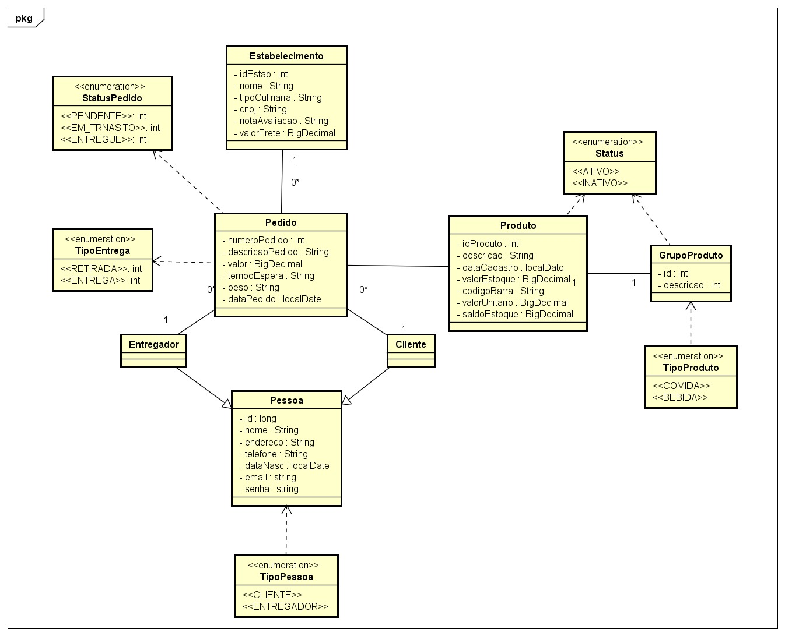

# 📦 Projeto iFood Java com Spring

## 📌 Sobre o Projeto
Este é um projeto desenvolvido em **Java** utilizando o **Spring Framework**, que implementa operações **CRUD** e validações essenciais.

## 🚀 Funcionalidades

### 🔹 Métodos HTTP Implementados
Os seguintes métodos HTTP foram implementados para todas as classes:
- **GET** ➝ Busca registros
- **POST** ➝ Criação de registros
- **PUT** ➝ Atualização de registros
- **DELETE** ➝ Exclusão de registros

### ✅ Validações Implementadas
O projeto conta com as validações necessárias para garantir a integridade dos dados.

### 🔄 Herança
A classe base **Pessoa** é utilizada para herança entre as entidades **Cliente** e **Entregador**.

## 🗄 Banco de Dados Suportados
O projeto suporta os seguintes bancos de dados:
- **H2** (banco em memória para testes)
- **PostgreSQL** (banco de produção)

## ⚠ Tratamento de Erros
O sistema conta com um robusto tratamento de erros, incluindo:
- Retorno de mensagens amigáveis para o usuário
- Padronização de respostas HTTP para erros comuns

---

💡 *Sinta-se à vontade para contribuir ou sugerir melhorias!* 🚀
